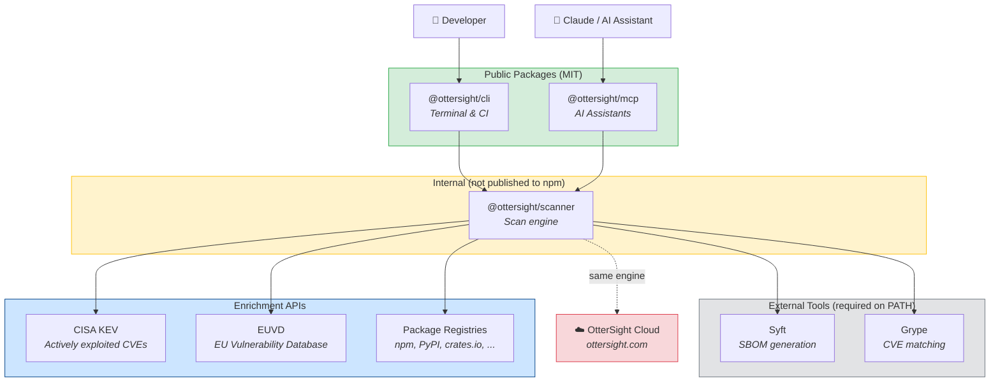

# OtterSight — OSS Scanner

[](https://github.com/Ottersight/ottersight-cli/actions/workflows/ci.yml)
[](https://www.npmjs.com/package/@ottersight/cli)
[](https://www.npmjs.com/package/@ottersight/mcp)
[](./LICENSE)

Local dependency security scanning for developers. Combines Syft (SBOM) + Grype (CVE) with CISA KEV enrichment and EU Vulnerability Database (EUVD) mapping.

```
$ ottersight scan .

Scanning /my-project...

CRITICAL (2)
  lodash    4.17.20  CVE-2021-23337  CRITICAL  EUVD-2021-12345  KEV ⚡  Fix: 4.17.21
  node      18.12.0  CVE-2023-30581  CRITICAL  —                —       Fix: 18.20.4

HIGH (5)
  ...

Summary: 127 components · 7 vulnerabilities · 2 actively exploited (KEV) · 3 EUVD entries
```

## Architecture



**How it works:** Both the CLI and the MCP server use the same internal scanner engine. The scanner orchestrates [Syft](https://github.com/anchore/syft) (SBOM) and [Grype](https://github.com/anchore/grype) (CVE matching), then enriches results with [CISA KEV](https://www.cisa.gov/known-exploited-vulnerabilities-catalog) data (actively exploited vulnerabilities), [EUVD](https://euvd.enisa.europa.eu/) mappings (EU NIS2/CRA compliance), and latest version lookups from package registries.

The scanner is an internal package — it powers both the CLI and [OtterSight Cloud](https://ottersight.com) but is not published to npm separately.

## Two Ways to Scan

### `@ottersight/cli` — for humans and CI pipelines

The command-line tool. Run it in your terminal or CI to scan a project and get a vulnerability report.

```bash
# No install needed
npx @ottersight/cli scan .

# Or install globally
npm install -g @ottersight/cli
ottersight scan .

# Docker (Syft + Grype bundled, nothing else to install)
docker run --rm -v $(pwd):/repo ottersight/cli scan /repo
```

Output: colored terminal table grouped by severity, summary line, optional `--output report.md` for Markdown.

### `@ottersight/mcp` — for AI assistants

The MCP server. Connects OtterSight scanning to Claude Desktop, Claude Code, and any other MCP-compatible AI assistant. Run `/ottersight-scan` in Claude Code to scan your current project without leaving your editor.

```bash
# Claude Code: register MCP server
claude mcp add ottersight -- npx -y @ottersight/mcp

# Claude Code: install the skill (enables /ottersight-scan command)
mkdir -p ~/.claude/skills/ottersight-scan
cp node_modules/@ottersight/mcp/SKILL.md ~/.claude/skills/ottersight-scan/SKILL.md
```

Then type `/ottersight-scan` in any Claude Code conversation to scan your current project.

### Which one do I need?

| I want to... | Use |
|---|---|
| Scan my project from the terminal | `@ottersight/cli` |
| Add scanning to a CI pipeline | `@ottersight/cli` (with `--quiet --output report.md`) |
| Scan without installing Syft/Grype | Docker image |
| Scan from Claude Code / Claude Desktop | `@ottersight/mcp` |

## Prerequisites

Syft and Grype must be on `PATH` (not needed with Docker):

```bash
# macOS
brew install anchore/grype/grype anchore/syft/syft

# Linux
curl -sSfL https://raw.githubusercontent.com/anchore/syft/main/install.sh | sh -s -- -b /usr/local/bin
curl -sSfL https://raw.githubusercontent.com/anchore/grype/main/install.sh | sh -s -- -b /usr/local/bin
```

## Use with AI Assistants

OtterSight ships an [MCP](https://modelcontextprotocol.io/) server (`@ottersight/mcp`) that connects your AI assistant to the same Syft + Grype + KEV + EUVD pipeline as the CLI. Once configured, your AI assistant can scan your project and explain the results — no terminal switching required.

### Claude Desktop

Add to `~/Library/Application Support/Claude/claude_desktop_config.json`:

```json
{
  "mcpServers": {
    "ottersight": {
      "command": "npx",
      "args": ["-y", "@ottersight/mcp"]
    }
  }
}
```

### Claude Code

Register the MCP server:

```bash
claude mcp add ottersight -- npx -y @ottersight/mcp
```

Install the `/ottersight-scan` skill so you can trigger scans with a single command:

```bash
mkdir -p ~/.claude/skills/ottersight-scan
curl -sSL https://raw.githubusercontent.com/Ottersight/ottersight-cli/main/packages/mcp/SKILL.md \
  -o ~/.claude/skills/ottersight-scan/SKILL.md
```

Then type `/ottersight-scan` in any Claude Code conversation to scan your current project.

### Available Tools

| Tool | Description |
|------|-------------|
| `scan` | Scan a directory for CVEs (Syft + Grype + KEV + EUVD enrichment) |
| `check-kev` | Check if a CVE is in the CISA Known Exploited Vulnerabilities catalog |
| `lookup-euvd` | Look up the EU Vulnerability Database ID for a given CVE |

## OtterSight Cloud

> **This repo** is the free, open-source scanner. **[OtterSight Cloud](https://ottersight.com)** is the hosted service.

The CLI scans one project at a time, locally. OtterSight Cloud adds scheduled scanning across all your repos, a multi-repo dashboard, notifications when new CVEs drop, and EU compliance reporting (NIS2/CRA).

Sign up early at **[ottersight.com](https://ottersight.com)** for a launch discount.

## Development

```bash
pnpm install
pnpm build      # Build all packages
pnpm test       # Run tests
pnpm typecheck  # Type-check
```

### Repo Structure

```
packages/
├── scanner/   Internal scan engine (Syft + Grype + KEV + EUVD + registries)
├── cli/       CLI tool — imports scanner, renders terminal/markdown output
└── mcp/       MCP server — imports scanner, exposes tools to AI assistants
```

## Contributing

See [CONTRIBUTING.md](./CONTRIBUTING.md).

## Security

See [SECURITY.md](./SECURITY.md).

## License

[MIT](./LICENSE) — Part of the [OtterSight](https://ottersight.com) open-core platform.
