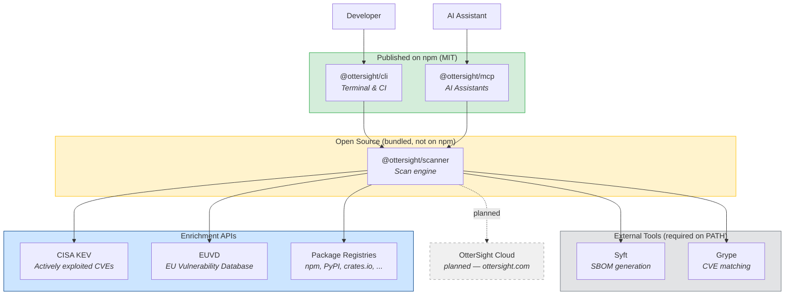

# OtterSight — OSS Scanner

[](https://github.com/Ottersight/ottersight-cli/actions/workflows/ci.yml)
[](https://www.npmjs.com/package/@ottersight/cli)
[](https://www.npmjs.com/package/@ottersight/mcp)
[](./LICENSE)

Local dependency security scanning for developers. Combines Syft (SBOM) + Grype (CVE) with CISA KEV enrichment and EU Vulnerability Database (EUVD) mapping.

## TL;DR

Scan your dependencies for known vulnerabilities — locally, in CI, or from your AI assistant.

```bash
npx @ottersight/cli scan .                                  # Terminal / CI
docker run --rm -v $(pwd):/repo ottersight/cli scan /repo   # Docker (no deps needed)
```

For Claude Code, install the skill and type `/ottersight-scan`:
```bash
mkdir -p ~/.claude/skills/ottersight-scan && curl -sSL \
  https://raw.githubusercontent.com/Ottersight/ottersight-cli/main/packages/mcp/SKILL.md \
  -o ~/.claude/skills/ottersight-scan/SKILL.md
```

```
$ ottersight scan .

Scanning /my-project...

CRITICAL (2)
  lodash    4.17.20  CVE-2021-23337  CRITICAL  EUVD-2021-12345  KEV ⚡  Fix: 4.17.21
  node      18.12.0  CVE-2023-30581  CRITICAL  —                —       Fix: 18.20.4

HIGH (5)
  ...

Summary: 127 components · 7 vulnerabilities · 2 actively exploited (KEV) · 3 EUVD entries
```

## Architecture



**How it works:** Both the CLI and the MCP server use the same scanner engine. The scanner orchestrates [Syft](https://github.com/anchore/syft) (SBOM) and [Grype](https://github.com/anchore/grype) (CVE matching), then enriches results with [CISA KEV](https://www.cisa.gov/known-exploited-vulnerabilities-catalog) data (actively exploited vulnerabilities), [EUVD](https://euvd.enisa.europa.eu/) mappings (EU NIS2/CRA compliance), and latest version lookups from package registries.

The scanner (`packages/scanner/`) is the core engine — open source and accepting contributions, but bundled into the CLI and MCP packages at build time rather than published to npm separately. If you want to improve the scanning pipeline, that's where to look.

## Two Ways to Scan

### `@ottersight/cli` — for humans and CI pipelines

The command-line tool. Run it in your terminal or CI to scan a project and get a vulnerability report.

```bash
# No install needed
npx @ottersight/cli scan .

# Or install globally
npm install -g @ottersight/cli
ottersight scan .

# Docker (Syft + Grype bundled, nothing else to install)
docker run --rm -v $(pwd):/repo ottersight/cli scan /repo
```

Output: colored terminal table grouped by severity, summary line, optional `--output report.md` for Markdown.

### `@ottersight/mcp` — for AI assistants

The MCP server. Connects OtterSight scanning to Claude Desktop, Claude Code, and any other MCP-compatible AI assistant.

**One command to install:**

```bash
mkdir -p ~/.claude/skills/ottersight-scan && curl -sSL \
  https://raw.githubusercontent.com/Ottersight/ottersight-cli/main/packages/mcp/SKILL.md \
  -o ~/.claude/skills/ottersight-scan/SKILL.md
```

Then type `/ottersight-scan` in Claude Code. The skill self-bootstraps — it registers the MCP server, checks for Syft/Grype, and runs the scan automatically. No manual setup needed.

### Which one do I need?

| I want to... | Use |
|---|---|
| Scan my project from the terminal | `@ottersight/cli` |
| Add scanning to a CI pipeline | `@ottersight/cli` (with `--quiet --output report.md`) |
| Scan without installing Syft/Grype | Docker image |
| Scan from Claude Code / Claude Desktop | `@ottersight/mcp` |

## Prerequisites

Syft and Grype must be on `PATH` (not needed with Docker):

```bash
# macOS
brew install anchore/grype/grype anchore/syft/syft

# Linux (Homebrew)
brew install anchore/grype/grype anchore/syft/syft

# Linux (install script — works on any distro including Alpine, Debian, Ubuntu)
curl -sSfL https://raw.githubusercontent.com/anchore/syft/main/install.sh | sh -s -- -b /usr/local/bin
curl -sSfL https://raw.githubusercontent.com/anchore/grype/main/install.sh | sh -s -- -b /usr/local/bin
```

## Use with AI Assistants

OtterSight ships an [MCP](https://modelcontextprotocol.io/) server (`@ottersight/mcp`) that connects your AI assistant to the same Syft + Grype + KEV + EUVD pipeline as the CLI. Once configured, your AI assistant can scan your project and explain the results — no terminal switching required.

### Claude Desktop

Add to `~/Library/Application Support/Claude/claude_desktop_config.json`:

```json
{
  "mcpServers": {
    "ottersight": {
      "command": "npx",
      "args": ["-y", "@ottersight/mcp"]
    }
  }
}
```

### Claude Code

Install the skill (one command):

```bash
mkdir -p ~/.claude/skills/ottersight-scan && curl -sSL \
  https://raw.githubusercontent.com/Ottersight/ottersight-cli/main/packages/mcp/SKILL.md \
  -o ~/.claude/skills/ottersight-scan/SKILL.md
```

Then type `/ottersight-scan` — the skill auto-registers the MCP server on first use.

<details>
<summary>Manual setup (if you prefer)</summary>

```bash
claude mcp add --scope user ottersight -- npx -y @ottersight/mcp
```
</details>

### Available Tools

| Tool | Description |
|------|-------------|
| `scan` | Scan a directory for CVEs (Syft + Grype + KEV + EUVD enrichment) |
| `check-kev` | Check if a CVE is in the CISA Known Exploited Vulnerabilities catalog |
| `lookup-euvd` | Look up the EU Vulnerability Database ID for a given CVE |

## Managing False Positives

Some npm packages ship Go binaries (e.g., esbuild). Grype detects Go stdlib CVEs in these binaries, even though they're build tools — not runtime dependencies. Create a `.grype.yaml` in your project root to exclude them:

```yaml
ignore:
  # Go binaries in node_modules are build tools, not runtime code
  - package:
      type: go-module
      name: stdlib
  - package:
      type: go-module
      name: github.com/evanw/esbuild
```

This reduces noise and lets you focus on vulnerabilities that actually matter.

## OtterSight Cloud

> **Coming soon.** [OtterSight Cloud](https://ottersight.com) will be the hosted service built on this scanner engine.

The CLI scans one project at a time, locally. OtterSight Cloud will add scheduled scanning across all your repos, a multi-repo dashboard, notifications when new CVEs drop, and EU compliance reporting (NIS2/CRA).

Sign up for early access at **[ottersight.com](https://ottersight.com)**.

## Development

```bash
pnpm install
pnpm build      # Build all packages
pnpm test       # Run tests
pnpm typecheck  # Type-check
```

### Repo Structure

```
packages/
├── scanner/   Scan engine — Syft + Grype orchestration, KEV/EUVD enrichment, registry lookups
│              Open source, bundled into CLI and MCP at build time (not published to npm)
├── cli/       CLI tool — imports scanner, renders terminal/markdown output
└── mcp/       MCP server — imports scanner, exposes tools to AI assistants
```

### Contributing to the Scanner

The scanner at `packages/scanner/` is the heart of OtterSight. It handles:
- Syft/Grype orchestration (`scan.ts`)
- CISA KEV lookups (`kev.ts`)
- EUVD mapping (`euvd.ts`)
- Package registry version checks (`registries.ts`)

Improvements here automatically benefit both the CLI and MCP packages. See [CONTRIBUTING.md](./CONTRIBUTING.md) for guidelines.

## Contributing

See [CONTRIBUTING.md](./CONTRIBUTING.md).

## Security

See [SECURITY.md](./SECURITY.md).

## License

[MIT](./LICENSE) — Part of the [OtterSight](https://ottersight.com) open-core platform.
