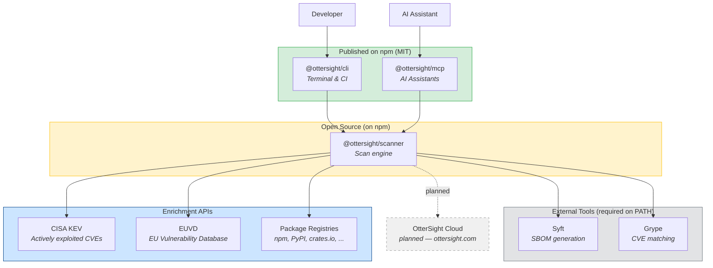

# OtterSight — OSS Scanner

[](https://github.com/Ottersight/ottersight-cli/actions/workflows/ci.yml)
[](https://www.npmjs.com/package/@ottersight/cli)
[](https://www.npmjs.com/package/@ottersight/mcp)
[](./LICENSE)

Local dependency security scanning for developers. Combines Syft (SBOM) + Grype (CVE) with CISA KEV enrichment and EU Vulnerability Database (EUVD) mapping.

## TL;DR

Scan your dependencies for known vulnerabilities — locally, in CI, or from your AI assistant.

```bash
npx @ottersight/cli scan .                                  # Terminal / CI
docker run --rm -v $(pwd):/repo ghcr.io/ottersight/cli scan .   # Docker (no deps needed)
```

For Claude Code, install the skill and type `/ottersight-scan`:
```bash
mkdir -p ~/.claude/skills/ottersight-scan && curl -sSL \
  https://raw.githubusercontent.com/Ottersight/ottersight-cli/main/packages/mcp/SKILL.md \
  -o ~/.claude/skills/ottersight-scan/SKILL.md
```

```
$ ottersight scan .

┌─────────────────────┬─────────┬────────────────┬─────────────────────┬──────────┬──────┬───────┬───────────┬─────────┐
│ Package             │ Version │ EUVD           │ Advisory            │ Severity │ CVSS │ EPSS  │ Exploited │ Fix     │
├─────────────────────┼─────────┼────────────────┼─────────────────────┼──────────┼──────┼───────┼───────────┼─────────┤
│ commons-collections │ 3.2.1   │ EUVD-2022-3799 │ GHSA-fjq5-5j5f-mvxh │ CRITICAL │ 9.8  │ 70.1% │ ⚠ EU KEV  │ 3.2.2   │
│ lodash              │ 4.17.20 │ EUVD-2021-0912 │ GHSA-35jh-r3h4-6jhm │ HIGH     │ 7.2  │ 21.3% │           │ 4.17.21 │
│ ...                 │         │                │                     │          │      │       │           │         │
└─────────────────────┴─────────┴────────────────┴─────────────────────┴──────────┴──────┴───────┴───────────┴─────────┘
7 vulnerabilities found (1 critical, 3 high, 3 medium) · 1 known exploited (1 only in EU KEV)
Vulnerability data: ENISA EU Vulnerability Database (EUVD), source acknowledged · Anchore Grype DB · CISA KEV · FIRST EPSS
```

## Architecture


```mermaid
graph TB
    subgraph Public["Published on npm (MIT)"]
        CLI["@ottersight/cli<br/><i>Terminal & CI</i>"]
        MCP["@ottersight/mcp<br/><i>AI Assistants</i>"]
    end

    subgraph Core["Open Source (on npm)"]
        Scanner["@ottersight/scanner<br/><i>Scan engine</i>"]
    end

    subgraph Tools["External Tools (required on PATH)"]
        Syft["Syft<br/><i>SBOM generation</i>"]
        Grype["Grype<br/><i>CVE matching</i>"]
    end

    subgraph Enrichment["Enrichment APIs"]
        KEV["CISA KEV<br/><i>Actively exploited CVEs</i>"]
        EUVD["EUVD<br/><i>EU Vulnerability Database</i>"]
        Registries["Package Registries<br/><i>npm, PyPI, crates.io, ...</i>"]
    end

    User["Developer"] --> CLI
    AI["AI Assistant"] --> MCP
    CLI --> Scanner
    MCP --> Scanner
    Scanner --> Syft
    Scanner --> Grype
    Scanner --> KEV
    Scanner --> EUVD
    Scanner --> Registries

    Cloud["OtterSight Cloud<br/><i>planned — ottersight.com</i>"]
    Scanner -.->|"planned"| Cloud

    style Public fill:#d4edda,stroke:#28a745
    style Core fill:#fff3cd,stroke:#ffc107
    style Tools fill:#e2e3e5,stroke:#6c757d
    style Enrichment fill:#cce5ff,stroke:#004085
    style Cloud fill:#f0f0f0,stroke:#999,stroke-dasharray: 5 5
```

**How it works:** Both the CLI and the MCP server use the same scanner engine. The scanner orchestrates [Syft](https://github.com/anchore/syft) (SBOM) and [Grype](https://github.com/anchore/grype) (CVE matching), then enriches results with ENISA's [EU Vulnerability Database (EUVD)](https://euvd.enisa.europa.eu/): EUVD identifiers and known exploitation from EUVD's KEV data, which combines the **EU KEV** (confirmed exploitation against EU entities) with [CISA KEV](https://www.cisa.gov/known-exploited-vulnerabilities-catalog). CVSS and EPSS come from the Grype match, and latest version lookups from package registries.

The scanner (`packages/scanner/`) is the core engine — open source, published on npm as `@ottersight/scanner`, and also bundled into the CLI and MCP packages at build time. If you want to improve the scanning pipeline, that's where to look.

## Two Ways to Scan

### `@ottersight/cli` — for humans and CI pipelines

The command-line tool. Run it in your terminal or CI to scan a project and get a vulnerability report.

```bash
# No install needed
npx @ottersight/cli scan .

# Or install globally
npm install -g @ottersight/cli
ottersight scan .

# Docker (Syft + Grype bundled, nothing else to install)
docker run --rm -v $(pwd):/repo ghcr.io/ottersight/cli scan .
```

Output: colored terminal table grouped by severity, summary line, optional `--output report.md` for Markdown, `--format sarif` for GitHub Code Scanning, or `--format json` with every enriched field (EUVD ID, KEV sources, CVSS, EPSS, CVE alias).

The exit code is 0 whenever the scan completes, even with findings. To fail a CI job, use `--fail-on`:

```bash
ottersight scan . --fail-on high   # exit 1 on any high or critical finding
ottersight scan . --fail-on kev    # exit 1 on any known-exploited finding (EU or CISA KEV)
```

Findings suppressed with `--ignore` don't count. A scan that can't run (e.g. Syft/Grype missing or failing) also exits 1.

### `@ottersight/mcp` — for AI assistants

The MCP server. Connects OtterSight scanning to Claude Desktop, Claude Code, and any other MCP-compatible AI assistant.

**One command to install:**

```bash
mkdir -p ~/.claude/skills/ottersight-scan && curl -sSL \
  https://raw.githubusercontent.com/Ottersight/ottersight-cli/main/packages/mcp/SKILL.md \
  -o ~/.claude/skills/ottersight-scan/SKILL.md
```

Then type `/ottersight-scan` in Claude Code. The skill self-bootstraps — it registers the MCP server, checks for Syft/Grype, and runs the scan automatically. No manual setup needed.

### Which one do I need?

| I want to... | Use |
|---|---|
| Scan my project from the terminal | `@ottersight/cli` |
| Add scanning to a CI pipeline | `@ottersight/cli` (with `--quiet --fail-on high`, plus `--output report.md`, `--format sarif` or `--format json`) |
| Scan without installing Syft/Grype | Docker image |
| Scan from Claude Code / Claude Desktop | `@ottersight/mcp` |

## Prerequisites

Syft and Grype must be on `PATH` (not needed with Docker):

```bash
# macOS
brew install anchore/grype/grype anchore/syft/syft

# Linux (Homebrew)
brew install anchore/grype/grype anchore/syft/syft

# Linux (install script — works on any distro including Alpine, Debian, Ubuntu)
curl -sSfL https://raw.githubusercontent.com/anchore/syft/main/install.sh | sh -s -- -b /usr/local/bin
curl -sSfL https://raw.githubusercontent.com/anchore/grype/main/install.sh | sh -s -- -b /usr/local/bin
```

## Use with AI Assistants

OtterSight ships an [MCP](https://modelcontextprotocol.io/) server (`@ottersight/mcp`) that connects your AI assistant to the same Syft + Grype + KEV + EUVD pipeline as the CLI. Once configured, your AI assistant can scan your project and explain the results — no terminal switching required.

### Claude Desktop

Add to `~/Library/Application Support/Claude/claude_desktop_config.json`:

```json
{
  "mcpServers": {
    "ottersight": {
      "command": "npx",
      "args": ["-y", "@ottersight/mcp"]
    }
  }
}
```

### Claude Code

Install the skill (one command):

```bash
mkdir -p ~/.claude/skills/ottersight-scan && curl -sSL \
  https://raw.githubusercontent.com/Ottersight/ottersight-cli/main/packages/mcp/SKILL.md \
  -o ~/.claude/skills/ottersight-scan/SKILL.md
```

Then type `/ottersight-scan` — the skill auto-registers the MCP server on first use.

<details>
<summary>Manual setup (if you prefer)</summary>

```bash
claude mcp add --scope user ottersight -- npx -y @ottersight/mcp
```
</details>

### Available Tools

| Tool | Description |
|------|-------------|
| `scan` | Scan a directory for CVEs (Syft + Grype + KEV + EUVD enrichment) |
| `check-kev` | Check if a CVE is known exploited (EU KEV and CISA KEV, via ENISA EUVD) and since when |
| `lookup-euvd` | Look up the EUVD entry for a CVE: EUVD ID, CVSS, EPSS, exploitation date, aliases |

## Managing False Positives

Some npm packages ship Go binaries (e.g., esbuild). Grype detects Go stdlib CVEs in these binaries, even though they're build tools — not runtime dependencies. Create a `.grype.yaml` in your project root to exclude them:

```yaml
ignore:
  # Go binaries in node_modules are build tools, not runtime code
  - package:
      type: go-module
      name: stdlib
  - package:
      type: go-module
      name: github.com/evanw/esbuild
```

This reduces noise and lets you focus on vulnerabilities that actually matter.

To suppress individual vulnerabilities (accepted risk, false positive), use `--ignore`:

```bash
ottersight scan . --ignore CVE-2021-23337 --ignore GHSA-29mw-wpgm-hmr9
```

Some findings only carry a GitHub advisory ID (GHSA) and no CVE, so EUVD and KEV data can't be matched. For those, OtterSight asks [OSV.dev](https://osv.dev) for the CVE alias. OSV.dev is operated by Google (US). To keep these lookups off, use `--no-osv` (CLI) or set `OTTERSIGHT_NO_OSV=1` (MCP server).

## EU sources only

`--eu-sources` keeps enrichment on EU infrastructure: known-exploited data and EUVD IDs come from ENISA EUVD only (no request to CISA's catalogue on GitHub, no OSV.dev), and Syft and Grype skip their update checks for new app versions.

Grype still needs its vulnerability database. By default it is downloaded from Anchore (`grype.anchore.io`, US). Point Grype at a mirror you trust with `--grype-db-url` (or `OTTERSIGHT_GRYPE_DB_URL`); the scan then fails if the mirror can't be reached instead of silently using an older database.

```bash
ottersight scan . --eu-sources --grype-db-url https://<your-mirror>/databases
```

For the MCP server, set `OTTERSIGHT_EU_SOURCES=1` and `OTTERSIGHT_GRYPE_DB_URL`.

Note: the Grype database itself is compiled from sources that include US ones (NVD, GitHub Advisory Database, CISA KEV and FIRST EPSS data). `--eu-sources` controls which endpoints are contacted at scan time, not where the data originates.

## OtterSight Cloud

> **Coming soon.** [OtterSight Cloud](https://ottersight.com) will be the hosted service built on this scanner engine.

The CLI scans one project at a time, locally. OtterSight Cloud will add scheduled scanning across all your repos, a multi-repo dashboard, notifications when new CVEs drop, and EU compliance reporting (NIS2/CRA).

Sign up for early access at **[ottersight.com](https://ottersight.com)**.

## Development

```bash
pnpm install
pnpm build      # Build all packages
pnpm test       # Run tests
pnpm typecheck  # Type-check
```

### Repo Structure

```
packages/
├── scanner/   Scan engine — Syft + Grype orchestration, KEV/EUVD enrichment, registry lookups
│              Published as @ottersight/scanner, also bundled into CLI and MCP at build time
├── cli/       CLI tool — imports scanner, renders terminal/markdown output
└── mcp/       MCP server — imports scanner, exposes tools to AI assistants
```

### Contributing to the Scanner

The scanner at `packages/scanner/` is the heart of OtterSight. It handles:
- Syft/Grype orchestration (`scan.ts`)
- CISA KEV lookups (`kev.ts`)
- EUVD mapping (`euvd.ts`)
- Package registry version checks (`registries.ts`)

Improvements here automatically benefit both the CLI and MCP packages. See [CONTRIBUTING.md](./CONTRIBUTING.md) for guidelines.

## Contributing

See [CONTRIBUTING.md](./CONTRIBUTING.md).

## Data Sources

| Source | Operator | Jurisdiction | Used for | Terms |
|---|---|---|---|---|
| [Grype vulnerability DB](https://github.com/anchore/grype) | Anchore (built from NVD, GitHub Advisory Database, distro feeds and others) | US | Matching packages to vulnerabilities | Upstream terms apply, e.g. GitHub Advisory Database CC-BY-4.0 |
| [EUVD](https://euvd.enisa.europa.eu/) | ENISA | EU | EUVD identifiers, records, and known exploitation (EU KEV + CISA KEV via `/api/kev/dump`) | Reproduction authorised provided the source is acknowledged |
| [CISA KEV](https://www.cisa.gov/known-exploited-vulnerabilities-catalog) | CISA (included in EUVD's KEV data; [cisagov/kev-data](https://github.com/cisagov/kev-data) GitHub mirror as fallback) | US | Known exploited vulnerabilities | CC0 |
| [EPSS](https://www.first.org/epss/) | FIRST (via the Grype DB) | US | Exploit probability | FIRST terms, attribution |
| [OSV.dev](https://osv.dev) | Google | US | CVE aliases for findings that only have a GHSA ID (off with `--no-osv` / `OTTERSIGHT_NO_OSV=1`) | [OSV terms](https://google.github.io/osv.dev/faq/); GitHub Advisory Database CC-BY-4.0 |
| npm, PyPI, crates.io, Go proxy, Packagist | Registry operators | Mostly US | Latest version lookups | Public APIs |

Vulnerability data: ENISA EU Vulnerability Database (EUVD), source acknowledged. OtterSight is not affiliated with or endorsed by ENISA.

## Security

See [SECURITY.md](./SECURITY.md).

## License

[MIT](./LICENSE) — Part of the [OtterSight](https://ottersight.com) open-core platform.
